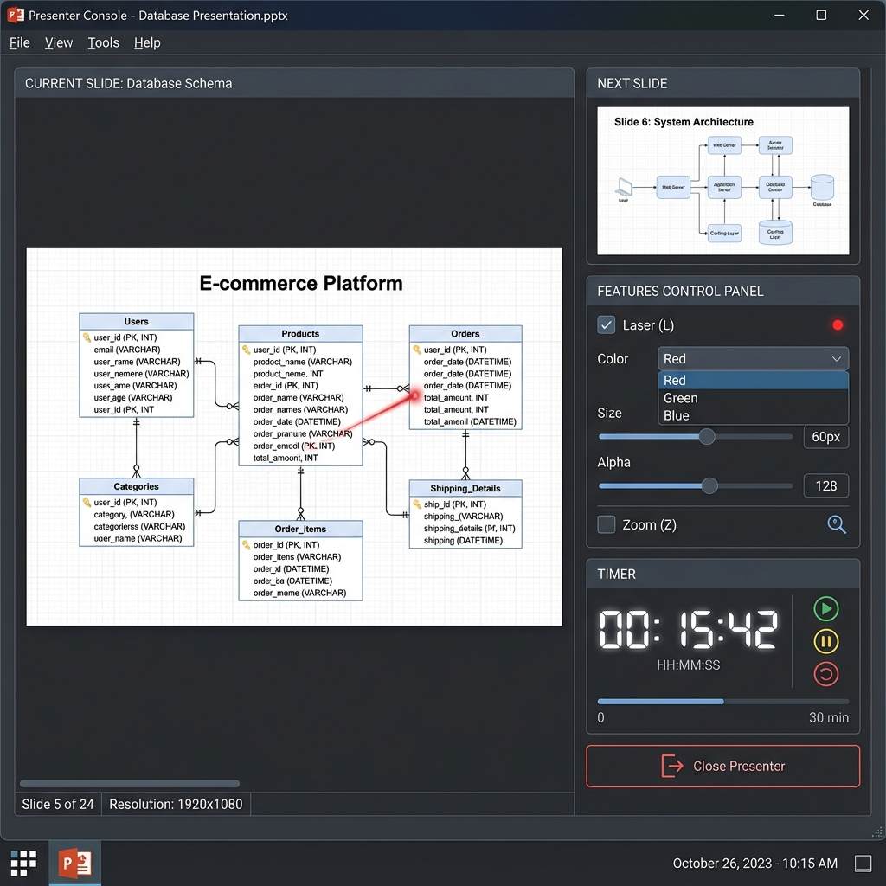
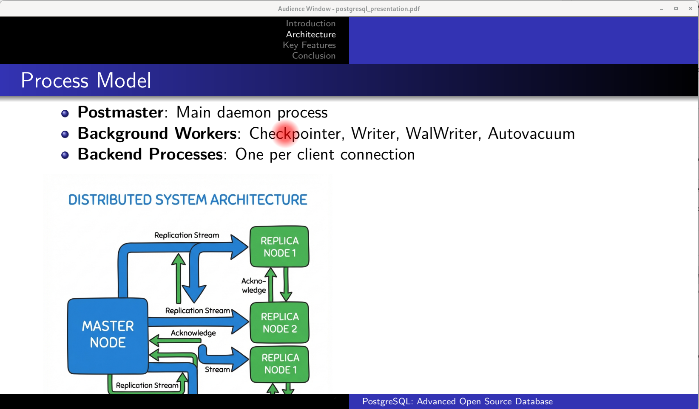

# my_presenter

A robust, C++ based dual-screen PDF presentation tool built with **Qt 6**. Designed for professionals, it emulates the functionality of tools like *Pympress* but with the performance and native look-and-feel of C++.

## Overview

It features a dedicated **Presenter Console** with wall-clock and elapsed timers, next-slide previews, and support for LaTeX Beamer notes (split-screen mode).

## Visual Tour

### Presenter Console
The console runs on your primary screen, giving you full control over the presentation while keeping you on time.



### Audience View
The audience sees a distraction-free, full-screen slide view on the secondary monitor.

## Key Features

- **Dual-Window Architecture**:
    - **Audience View**: Automatically opens on a Secondary Screen (if detected).
    - **Presenter Console**: Control center with Current Slide, Next Slide Preview, Timers, Notes, and TOC.
- **Screen Management**:
    - **Intelligent Screen Swapping**: Easily switch screens with `S`.
    - **Split View Toggle**: Support for Beamer split-slides (Left=Slide, Right=Notes) using `Ctrl+S`.

## Tools Showcase

### Laser Pointer
A high-visibility dot to highlight key areas. Toggle with `L`.
- **Colors**: Red (`R`), Green (`G`), Blue (`B`), White (`W`).
- **Adjustable**: Resize with `+` / `-`.



### Zoom Pointer
Magnify specific details on the slide for better visibility. Toggle with `Z`.

> *Screenshot needed: Zoom Pointer in action*

### Drawing Mode
Annotate your slides directly during the presentation. Toggle with `D`.

> *Screenshot needed: Drawing annotations on a slide*

## Installation & Build

### Prerequisites
- **Operating System**: Linux (Debian/Ubuntu recommended) or macOS.
- **Dependencies**: Qt 6 (Core, Gui, Widgets, Pdf, PdfWidgets), `make`, C++17 compiler (`g++` or `clang++`).

### Quick Start (Linux & macOS)

1. **Install Dependencies**:
   ```bash
   ./install_dependencies.sh
   ```

2. **Build**:
   ```bash
   make
   ```

3. **Run**:
   ```bash
   ./bin/app
   ```

## Usage Guide

### Control Reference

#### Navigation
| Key | Action |
| :--- | :--- |
| **Right** / **Space** / **Down** | Next Slide |
| **Left** / **Backspace** / **Up** | Previous Slide |
| **Home** / **End** | First / Last Slide |
| **Page Up** / **Down** | Previous / Next Slide |

#### Pointers & Tools
| Key | Action |
| :--- | :--- |
| **L** | Toggle **Laser Pointer** |
| **Z** | Toggle **Zoom Pointer** |
| **D** | Toggle **Drawing Mode** |
| **N** | **Normal Cursor** (Reset all) |
| **+** / **=** | **Increase** Size |
| **-** | **Decrease** Size |
| **R** / **G** / **B** / **W** | Color: Red / Green / Blue / White |

#### View & App Controls
| Key | Action |
| :--- | :--- |
| **S** | **Switch Screens** |
| **Ctrl + S** | Toggle **Split View** (Beamer) |
| **T** / **P** | Toggle Timer |
| **Q** / **Esc** | Quit Application |

## Repository Structure

- `src/`: Source code.
- `include/`: Headers.
- `bin/`: Executable output.
- `slides/`: Example PDFs.

---
*Created by [josmac69](https://github.com/josmac69).*